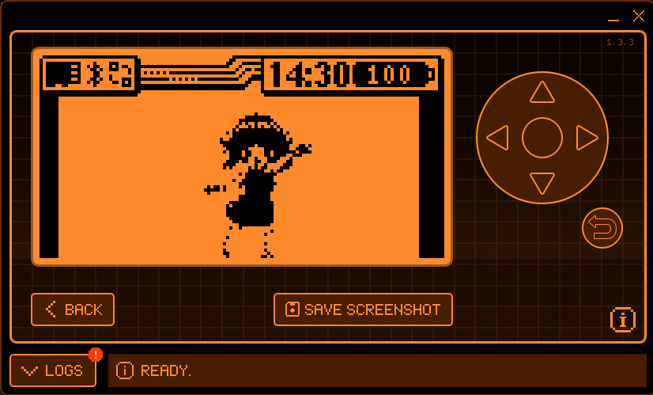

# My Flipper animation - Lolicon Dance
<b>萝莉摇 on flipper zero</b>   
绿幕: https://www.youtube.com/watch?v=Cm6WDbmrvls
  

# 开始
自知技术力不足,剪辑编程样样不足  
    
## 视频处理  
+ flipper zero只能显示黑白图
+ 视频分辨率要转成`128x64`  

## 视频转png
+ 进入[python3_tools](./python3_tools) 目录: `cd python3_tools`
+ 使用`pip3`安装 [requirements.txt](python3_tools/requirements.txt) : `pip3 install -r requirements.txt`
+ 稍微修改 [python3脚本](./python3_tools/main.py) 中的代码,把视频地址改成自己的 
+ 运行脚本: `python3 main.py`
+ 查看转换后的效果

## png转fliiper图
+ [youtube视频教程](https://www.youtube.com/watch?v=Nq5DXhOMo5s)  
+ 首先克隆`flipperzero-firmware`到本地: `git clone https://github.com/flipperdevices/flipperzero-firmware` 
+ 进入 [flipper存放动画的目录](./flipperzero-firmware/assets/dolphin/external/) : `./flipperzero-firmware/assets/dolphin/external/`  
+ 把转换后的png文件夹复制过来
+ 修改该文件夹中的`manifest.txt`文件夹, 把自己动画文件夹添加进来(我删除了原有的动画)  
+ 进入刚复制的png文件夹,创建并修改`meta.txt`文件,格式可参考`flipper自带的文件或者下图中这样`     
+ 回到`flipperzero-firmware`目录, 构建动画`./fbt icons proto dolphin_internal dolphin_ext resources` (若初次运行,这可能要执行两次,第一次会下载所需资源文件)  
+ 构建好的动画保存在 `./build/f7-firmware-D/assets/compiled/dolphin/` 目录下, <b>视频中的路径是过时的</b>
+ 下载[qFlipper](https://github.com/flipperdevices/qFlipper), linux要使用管理权限运行, 使用qFlipper连接你的Flipper, 在qFlipper访问`sd卡/dolphin`目录,把构建好的动画文件夹及`manifest.txt`文件复制进qFlipper中  
+ 重启你的flipper即可刷新动画
